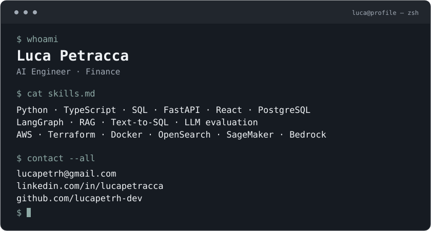
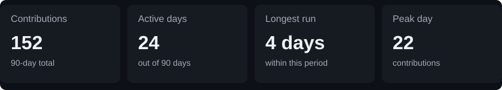

<picture>
  <source media="(max-width: 600px)" srcset="assets/profile-terminal-charcoal-mobile.svg">
  
</picture>

# About me.

AI Engineer with 3 years of experience designing and deploying production AI systems in finance. Specialized in multi-agent
LLM architectures that encompass data retrieval, portfolio management, and risk and performance analysis, with end-to-end
ownership from architecture to deployment.

[Explore my work](#selected-work) · [Email](mailto:lucapetrh@gmail.com) · [LinkedIn](https://www.linkedin.com/in/lucapetracca/) · [CV](https://github.com/lucapetrh-dev/lucapetrh-dev/blob/main/docs/Luca-Petracca-CV-2026.pdf)

## Activity at a glance

<picture>
  <source media="(max-width: 600px)" srcset="assets/profile-activity-charcoal-mobile.svg">
  
</picture>

## Selected work

A selection of recent builds, ongoing research and customized open-source projects. Private repositories are described here without exposing their source.

### Wallet

A self-hosted finance workspace for accounts, transactions and investments. Includes provider integrations, transaction categorization and a mobile-friendly interface.

### OpenNote

A Windows workspace for notes, projects, meeting recordings and dictation. Notes stay on the device; transcription and note processing use a configured AWS account.

### Jobs

My customized JobSync installation brings applications, resumes, contacts and interview preparation into one workspace. I maintain the deployment and access controls for my private hosted instance.

[Explore Jobs](https://github.com/lucapetrh-dev/jobsync)

### Learn

A personal learning workflow built around guided questions and visual explanations, with an optional renderer that turns Mermaid and SVG diagrams into PNGs.

[Explore Learn](https://github.com/lucapetrh-dev/learn)

### Financial Forecasting

Master's Thesis on Transformers for Financial Forecasting: a cryptocurrency return-forecasting pipeline with leakage-aware evaluation, sentiment comparisons and transformer benchmarks. Reproducible experiments and comparable baselines are the focus.

[Explore Master Thesis](https://github.com/lucapetrh-dev/Transformers-Financial-Time-Series-Forecasting)

### ECB Data Portal Chatbot

A conversational interface for finding datasets and time series in the ECB Data Portal. It combines natural-language queries, parallel retrieval, SQL-based value lookup, dynamic charts and tables generation.

## Get in touch

To get in touch, [find me on LinkedIn](https://www.linkedin.com/in/lucapetracca/).

## Contributions

